# 📊 Aapda Setu - Website Data Flow Report

**Generated**: December 10, 2025  
**Project**: Aapda Setu Admin Dashboard (Next.js)  
**Focus**: Website data flow from Login to Complaint/Report management

---

## 📖 Overview

This report documents the data flow in the **Aapda Setu Admin Dashboard** - a Next.js web application used by administrators to manage disaster reports and complaints. The dashboard connects to a Node.js backend API for authentication and data management.

---

## 🏗️ Website Architecture

```mermaid
flowchart TB
    subgraph Frontend["Next.js Admin Dashboard (Port 3000)"]
        Login["🔐 Login Page<br/>/login"]
        Dashboard["📊 Dashboard<br/>/dashboard"]
        Reports["📋 Reports<br/>/reports"]
        Verification["✅ Verification<br/>/verification"]
        Map["🗺️ Map<br/>/map"]
        Alerts["🔔 Alerts<br/>/alerts"]
        Analytics["📈 Analytics<br/>/analytics"]
        Settings["⚙️ Settings<br/>/settings"]
    end
    
    subgraph Backend["Node.js API Gateway (Port 3000)"]
        AuthAPI["Auth Routes"]
        ReportsAPI["Reports Routes"]
        AlertsAPI["Alerts Routes"]
        AnalyticsAPI["Analytics Routes"]
    end
    
    subgraph Storage["Data Storage"]
        MongoDB[(MongoDB)]
        Redis[(Redis Cache)]
    end
    
    Login --> AuthAPI
    Dashboard --> AnalyticsAPI
    Reports --> ReportsAPI
    Verification --> ReportsAPI
    Alerts --> AlertsAPI
    
    AuthAPI --> MongoDB
    ReportsAPI --> MongoDB
    AlertsAPI --> MongoDB
    AuthAPI --> Redis
```

---

## 🔐 Login Flow

### Step-by-Step Authentication Process

```mermaid
sequenceDiagram
    participant Admin as 👤 Admin User
    participant Browser as 🌐 Browser
    participant Next as Next.js Frontend
    participant API as API Gateway
    participant DB as MongoDB

    Admin->>Browser: Navigate to /login
    Browser->>Next: Load Login Page
    Next-->>Browser: Render Login Form
    
    Admin->>Browser: Enter Email + Password
    Admin->>Browser: Click "Sign In"
    Browser->>Next: Form Submit
    Next->>API: POST /api/v1/auth/admin/login
    Note right of API: {email, password}
    
    API->>DB: Query User (email + admin role)
    DB-->>API: User Record
    
    alt Valid Credentials
        API->>API: Generate JWT Token
        API-->>Next: {access_token, user}
        Next->>Browser: Store in localStorage
        Next->>Browser: Redirect to /dashboard
    else Invalid Credentials
        API-->>Next: {error: "Invalid credentials"}
        Next-->>Browser: Show Error Message
    end
```

---

## 📸 Website Screenshots

### 1. Login Page

The admin login page provides secure access to the dashboard.

**Features:**
- Email input field
- Password input field  
- "Sign In" button
- Professional dark theme with red accent
- Shield icon branding

---

### 2. Login Attempt (Error State)

When credentials are invalid or backend is unavailable:

**Error Handling:**
- Clear error message displayed
- Form remains usable for retry
- Error styled with red background

---

### 3. Protected Routes

All dashboard pages require authentication. Unauthenticated requests redirect to /login:

---

## 🎬 Login Flow Recording

The complete login flow was recorded:

---

## 📋 Report/Complaint Management Flow

### Viewing Reports

---

### Verifying a Complaint

```mermaid
sequenceDiagram
    participant Admin as 👤 Admin
    participant Dashboard as Dashboard
    participant API as API Gateway
    participant DB as MongoDB
    participant FCM as Firebase FCM

    Admin->>Dashboard: Navigate to /verification
    Dashboard->>API: GET /api/v1/reports?status=pending
    API-->>Dashboard: Pending Reports
    
    Admin->>Dashboard: Review Report Details
    Admin->>Dashboard: Click Verify/Reject
    
    Dashboard->>API: POST /api/v1/reports/:id/verify
    Note right of API: {status: "verified", note: "..."}
    
    API->>DB: Update Report Status
    API->>FCM: Notify Reporter (optional)
    API-->>Dashboard: Updated Report
    Dashboard-->>Admin: Show Confirmation
```

---

## 🗂️ Website Page Structure

| Page | Route | Description |
|------|-------|-------------|
| **Login** | `/login` | Admin authentication |
| **Dashboard** | `/dashboard` | Overview stats & charts |
| **Reports** | `/reports` | All reports list |
| **Verification** | `/verification` | Pending reports queue |
| **Map** | `/map` | Geographic view of incidents |
| **Alerts** | `/alerts` | Emergency alert management |
| **Analytics** | `/analytics` | Trend analysis & metrics |
| **Users** | `/users` | User management |
| **Settings** | `/settings` | System configuration |

---

## 🔌 API Endpoints Used by Website

| Endpoint | Method | Purpose |
|----------|--------|---------|
| `/api/v1/auth/admin/login` | POST | Admin login |
| `/api/v1/auth/me` | GET | Get current user |
| `/api/v1/reports` | GET | List reports |
| `/api/v1/reports/:id` | GET | Report details |
| `/api/v1/reports/:id/verify` | POST | Verify/reject report |
| `/api/v1/admin/analytics` | GET | Dashboard stats |
| `/api/v1/alerts` | GET/POST | Manage alerts |

---

## 🔄 Data Flow Summary

```mermaid
flowchart LR
    Login["🔐 Login"] --> Auth["JWT Token"]
    Auth --> Dashboard["📊 Dashboard"]
    Dashboard --> Reports["📋 Reports"]
    Reports --> Verify["✅ Verify"]
    Verify --> Notify["🔔 Notify User"]
```

1. **Login**: Admin authenticates with email/password → receives JWT token
2. **Dashboard**: Token used to fetch statistics and recent activity
3. **Reports**: View all disaster reports with filters
4. **Verify**: Admin reviews and verifies/rejects pending reports
5. **Notify**: Reporters receive notification about their report status

---

## 📊 Technology Stack

- **Frontend**: Next.js 14 with App Router
- **Styling**: Tailwind CSS
- **HTTP Client**: Axios
- **State**: localStorage for auth token
- **Maps**: MapLibre GL

---

**Report Version**: 2.0  
**Last Updated**: December 10, 2025
